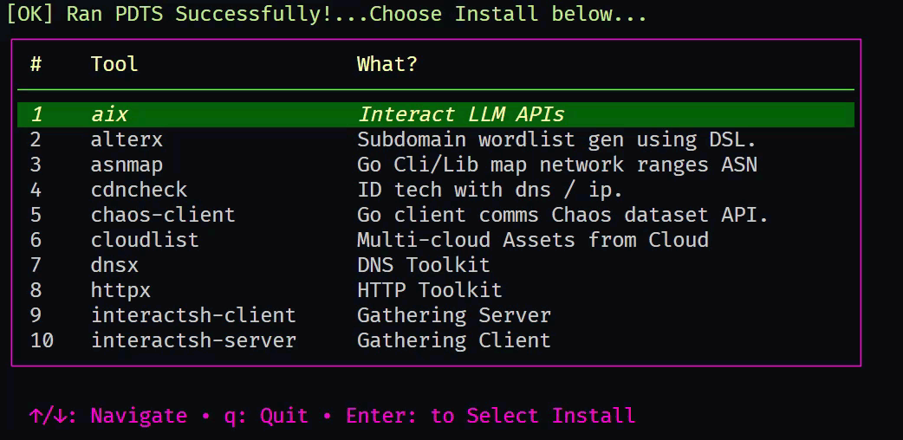

<p align="center">
<a href="https://twitter.com/mxiumsys"></a>
<a href="https://pkg.go.dev/github.com/mxiumz/mpdtm"></a>
</p>


<h1 align="center"><code> mpdtm </code></h1>
<h2 align="center"><i> <code>pdtm</code>  Installer Menu </i></h2>

1. [mpdtm](#mpdtm)
   1. [Demo Gif](#demo-gif)
2. [Installation Notes](#installation-notes)
3. [Use ?](#use-)
4. [Disclaimer](#disclaimer)
5. [You Like ? - Send XMR :) - 100% Anonymous](#you-like----send-xmr----100-anonymous)

----

# mpdtm
1. This is a utility which is a wrapper around [pdtm](https://github.com/projectdiscovery/pdtm)
2. Shows a nice menu with the description of the tools which can be selected for installation
3. This is a personal tool which I am releasing

## Demo Gif


# Installation Notes 

Step 1 :
You will need [pdtm](https://github.com/projectdiscovery/pdtm) installed 
```sh
go install -v github.com/projectdiscovery/pdtm/cmd/pdtm@latest
```

Step 2: Tool Installation 
```sh
go install -v github.com/mxiumz/mpdtm/cmd/mpdtm@latest
```

# Use ?

```
mpdtm
```

# Disclaimer 

<p align="center">

</p>

# You Like ? - Send XMR :) - 100% Anonymous

<p align="center">

</p>

```ml
48zTbMrEFHr2C5BVp5dHCeFf491uZbLEQ7KHMBYh7bfMXgKHdCm9UuG8KPvNugkhcAR8DWTwMhLE6Kw2zj1SZKkz2NjxYGj
```